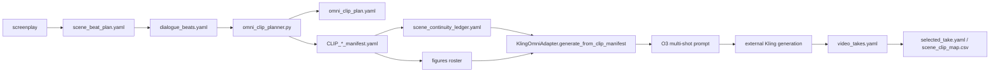
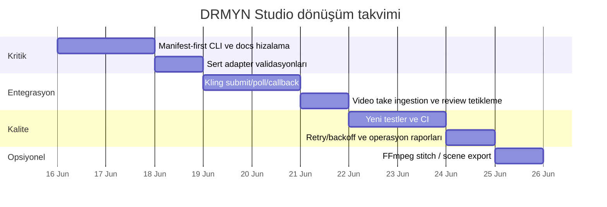

# DRMYN Studio için scriptten videoya dönüşüm araştırma raporu

## Yönetici özeti

Bu incelemenin en kritik sonucu şudur: erişebildiğim **`hknbb/drmynstudio-public`** deposu, kendi README’si ve “scientific clean release” manifestine göre **metadata-only** bir çerçevedir; harici model API çağrılarını çalıştırmaz, video dosyası üretmez, video/proxy binary kopyalamaz ve üretilen medyayı depoda tutmaz. Başka bir deyişle, public repo tek başına “script → final video” dönüştürücüsü değildir; en fazla **script → plan/manifest → prompt record → harici Kling üretimi → take metadata** hattını yönetir. Bu yüzden şu anki “dönüşüm sorunu”nun kök nedeni büyük olasılıkla tek bir küçük bug değil, **repo mimarisi ile beklenen çıktı davranışı arasındaki farktır**. citeturn5view1turn13view0turn26view1

Kod ve dokümantasyon arasında ayrıca güçlü bir **geçiş dönemi kırılması** var. `Scene Continuity System` dokümanı artık **kanonik yolun storyboard değil `omni_clip_manifest` tabanlı** olduğunu, hatta “legacy storyboard layer”ın kaldırıldığını söylüyor; buna karşın bazı model rehberi ve kapasite matrisi kayıtları hâlâ **storyboard seçimi** ve `shot_list_omni` gibi eski önkoşulları referans veriyor. Bu kırılma, CLI’nin ve operatör akışının bir kısmının eski yolu, testlerin ve metodoloji belgelerinin ise yeni yolu temel almasına yol açıyor. Bu, scriptten videoya gidişte en önemli entegrasyon problemidir. citeturn7view3turn25view0turn25view1

Uygulanabilir ana çözüm, hattı tek bir üretim gerçeğine indirgemektir: **`screenplay → scene_beat_plan → dialogue_beats → omni_clip_planner → omni_clip_manifest → KlingOmniAdapter.generate_from_clip_manifest() → harici Kling işi → video_takes → selected_take`**. Bu hat, repo dokümanlarında zaten kanonik olarak tanımlanmış durumda ve Kling’in resmi 3.0 Omni yönergeleriyle de uyumlu: **tek üretimde en fazla 6 shot/cut, toplam en fazla 15 saniye, prompt/negative prompt için 2500 karakter limiti**. citeturn5view1turn7view3turn19view0turn23search4turn23search1

Bu raporun pratik önerisi şu sıralamayı izliyor: önce **eski storyboard/scene-card yolunu pasif edip manifest-first** üretimi zorunlu kılın; sonra **Kling işi submit/poll/callback** katmanını ekleyin; ardından **sert doğrulama, test, CI ve output acceptance** ölçümlerini devreye alın. Böyle yaparsanız repo ilk kez gerçekten güvenilir bir “script → video job orchestration” sistemine dönüşür. citeturn7view3turn24search0turn24search3

## Depo anatomisi ve gerçek dönüşüm noktası

Bu oturumda GitHub connector çağrıları kullanılamadığı için doğrudan `api_tool` üzerinden private repoyu okuyamadım. Public web üzerinden **`hknbb/drmynstudio-public`** incelenebildi; **`hknbb/drmynstudio`** ise public web’de 404 döndü; bu da README’de söylendiği gibi private/aktif geliştirme deposu olma durumuyla uyumlu görünüyor. Bu nedenle aşağıdaki ayrıntılı kod incelemesi **public repo** üzerindendir; private repo için yalnızca public repo içindeki referanslardan sınırlı çıkarım yapılabildi. citeturn4view0turn4view1

Public repo kökünde görülen dizinler `.github/`, `docs/`, `model_guidance_snapshots/`, `schemas/`, `scripts/`, `templates/element_reference_prompts/`, `tests/`, `tools/copilot_dashboard/` ve meta dosyalardır. Buna karşılık README’nin anlattığı tam metodoloji düzeninde `source/`, `planning/`, `prompts/`, `visual_dev/`, `evidence/`, `archive/` gibi çalışma dizinleri de yer alır. Public snapshot manifesti de açıkça bu yayının metodoloji ağırlıklı ve seçici olduğunu, binary’leri, gerçek API çağrılarını ve bazı dış referansları dışarıda bıraktığını söylüyor. Bu, public repo ile aktif/private repo arasında içerik farkı olduğunu gösterir. citeturn5view1turn4view1turn26view0turn26view1

| Depo | Durum | Bu oturumdaki erişim | Ne anlama geliyor |
|---|---|---:|---|
| `hknbb/drmynstudio` | Active/private development repo olarak referanslanıyor | Doğrudan içerik okunamadı | Private repo içindeki gerçek çalışma kayıtları, scene data ve olası runtime katmanı bu raporda doğrulanamadı |
| `hknbb/drmynstudio-public` | Public yöntem/reproducibility repo | Ayrıntılı incelendi | Gerçek medya üretmekten çok metodoloji, validator, adapter ve test altyapısı var |

Aşağıdaki modüller, scriptten videoya giden hattın kritik düğümleridir:

| Dosya / modül | Rolü | Neden önemli |
|---|---|---|
| `scripts/agents/omni_clip_planner.py` | Beat’leri shot’lara ve clip’lere deterministik paketliyor | `scene_beat_plan` ve `dialogue_beats`’ten `omni_clip_manifest` üretiyor |
| `scripts/agents/adapters/kling_omni.py` | Kling Omni prompt adapter’ı | `generate_from_clip_manifest()` ile clip manifesti prompt/run record’a çeviriyor |
| `scripts/agents/run_pipeline.py` | Ana CLI entry point | `--mode` bazlı akışları başlatıyor |
| `scripts/validators/validate_omni_clip_manifest.py` | Clip manifest semantic validator | shot toplamı, line/beat referansları, 6-shot limiti gibi kuralları kontrol ediyor |
| `scripts/validators/validate_figure_roster.py` | Anti-clone validator | Aynı alias ile birden fazla figür kullanımını engelliyor |
| `scripts/validators/validate_scene_continuity_ledger.py` | Clipler arası continuity validator | screen direction ve subject position sürekliliğini denetliyor |
| `scripts/agents/video_take_review.py` | Harici üretilmiş take metadata inceleme katmanı | Generated video binary’lerini değil, onların metadata/review kayıtlarını yazıyor |

Depodaki ana giriş noktaları iki katmanda toplanıyor. Birincisi **Makefile**: `validate`, `integrity`, `manifests`, `numbered-fountain`, `seed-scenes`, `hydrate-scenes`, `canon-queue`, `freeze`, `closure-audit` gibi hedefler var. İkincisi **CLI**: `scripts/agents/run_pipeline.py`, `--mode` ile `refresh-model-guidance`, `generate-prompts`, `review-outputs`, `generate-kling-omni-prompts`, `review-video-takes`, `lock-scene-clip`, `operator-next-step`, `copilot-command`, `suggest-pr`, `pickup` akışlarını açıyor. Ancak bu CLI de kendi modül docstring’inde “external platforms çalıştırmadığını” ve clip locking’in bile metadata-only olduğunu açıkça söylüyor. citeturn7view2turn11view0turn11view1turn13view0

Bağımlılık tarafında `pyproject.toml`, Python `>=3.11`, temel bağımlılıklar olarak `jsonschema`, `PyYAML`, `yamllint`, `pandas`, `langgraph`; dev bağımlılıkları olarak `pytest`, `mypy`, `ruff`; UI için `streamlit` tanımlıyor. Buna karşın `requirements.txt` yalnızca çekirdek dört paketi içeriyor. Bu fark, özellikle test ve CLI/graph akışlarında yeniden üretilebilir kurulum açısından önemlidir. citeturn7view0turn7view1

Repo içinde **gerçek script → video dönüşüm noktası**, README ve metodoloji belgesine göre artık `generate(scene_id)` değil, **`KlingOmniAdapter.generate_from_clip_manifest()`** olmalıdır. Kanonik boru hattı açıkça şöyle tarif ediliyor: screenplay → `scene_beat_plan` → `dialogue_beats` → `omni_clip_planner` → `omni_clip_plan + clip manifests` → `scene_continuity_ledger` → `figures[] roster` → `KlingOmniAdapter.generate_from_clip_manifest()` → O3 multi-shot prompt → external Kling generation → `video_takes` → `selected_take`. Bu anlatım ayrıca “legacy storyboard layer removed” diyerek eski katmanın kaldırıldığını da belirtiyor. citeturn5view1turn7view3turn11view5

Aşağıdaki akış, mevcut belgelerde tarif edilen doğru üretim çizgisini özetliyor:



## Saptanan hata kaynakları ve entegrasyon kırıkları

En büyük yapısal problem, public repoda anlatılan “metadata-only” yaklaşım ile kullanıcı beklentisindeki “scripti videoya çevirme” davranışının aynı şey olmamasıdır. Public release manifest ve scientific clean release açıkça **harici model API çağrılarının kod tabanında bulunmadığını**, generated image/video/audio binary’lerinin depoda tutulmadığını ve medya üretiminin repo dışında, insan-operatör kontrollü şekilde yapıldığını söylüyor. Bu yüzden repo şu an en iyi ihtimalle **video üretim işlerini tarif eden bir orkestra/metadata sistemi**; doğrudan runtime renderer değildir. Scriptten videoya dönüşüm sorununuz, büyük olasılıkla burada başlıyor. citeturn26view0turn26view1turn5view1turn13view0

İkinci büyük problem, **eski storyboard/scene-card yolu ile yeni clip-manifest yolu arasındaki yarım göç**. `scene_continuity_system.md`, legacy storyboard katmanının kaldırıldığını ve kanonik prompt üretiminin `generate_from_clip_manifest()` üzerinden yürüdüğünü söylerken; `docs/model_guides/kling_omni.yaml` hâlâ “storyboard selected” önkoşulunu ve `shot_list_omni` merkezli gate’leri anıyor; `model_capability_matrix.yaml` da Phase 2’de storyboard visual direction seçilmiş olmasını şart koşuyor. Bu doküman ayrışması, operatörlerin ve CLI kodunun yanlış üretim yoluna yönelmesine neden olur. citeturn7view3turn25view0turn25view1

Üçüncü kritik sorun, **CLI’nin kanonik hattı sonuna kadar yansıtmamış olmasıdır**. Yerel kod incelememde `run_generate_kling_omni_prompts()` fonksiyonunun `adapter.generate(scene_id, ...)` çağırdığı, yani eski `scene_card.shot_list_omni` yolunu kullandığı; buna karşın repo metodolojisinin `generate_from_clip_manifest()` yolunu kanonik ilan ettiği görüldü. Böylece belgeler yeni hattı, kod ise eski hattı merkez alıyor. Bu, özellikle clip-level continuity, figure roster ve native-audio gate mantığını CLI’den kullanmak istediğinizde doğrudan yanlış davranış üretir. Bu bulgu, repo üzerinden fetch edilen kodun yerel çoğaltmasına dayanıyor; dokümantasyon tarafındaki yeni kanonik yol da ayrıca repo belgelerinde açıkça yazılı. citeturn7view3turn25view2

Dördüncü sorun, **kurulum ve test yeniden üretilebilirliğindeki çatlak**. Scientific clean release manifest, önce `pip install -r requirements.txt`, ardından `python -m pytest -q` çalıştırılmasını öneriyor; fakat `requirements.txt` içinde `pytest` yok, `pytest` yalnızca `pyproject.toml` içindeki dev extra’da tanımlı. Bu yüzden temiz bir ortamda dokümanı aynen izlemek test çalıştırma aşamasında bozulabilir. Aynı şekilde `pyproject.toml` repo sürümünü `0.1.4` diye verirken README `v0.18.0` diyor; public snapshot manifest `v0.17.0`, scientific clean release ise `v0.4.0` diyor. Bu versiyon kayması, hangi release belgesinin hangi kod tabanına ait olduğunun bulanıklaşmasına yol açar. citeturn26view1turn7view0turn7view1turn4view1turn26view0

Beşinci sorun, **public snapshot içeriklerinin operasyon için eksik olması**. Repo ana sayfasında bu snapshotta `source/`, `planning/`, `prompts/`, `visual_dev/`, `evidence/` gibi asıl çalışma veri dizinleri görünmüyor; buna karşın README ve scientific clean release bu katmanları sistemin ayrılmaz parçası olarak anlatıyor. Bu, public repoyu klonlayan bir kullanıcının tek başına end-to-end test veya gerçek bir sahne üretimi yapamamasına yol açabilir; çünkü kod var ama kritik veri kayıtları yok ya da yayın dışında bırakılmış. citeturn5view1turn4view1turn26view0turn26view1

Altıncı sorun, Kling tarafındaki resmi kısıtlarla adapter path arasında **sert validasyon boşluğu** olmasıdır. Hem resmi Kling 3.0 Omni yönergeleri hem de repo içindeki güncel Kling snapshot’ı tek jenerasyonda **en fazla 6 shot/cut** ve **en fazla 15 saniye** kuralını vurguluyor; repo validator’ı da 6-shot limitini kontrol ediyor. Buna karşın yerel çoğaltmada `generate_from_clip_manifest()` yolunun, 20 saniyelik tek-shot bir manifesti ve 1 saniyelik shot’lardan oluşan geçersiz manifestleri prompt record’a çevirebildiğini gördüm. Yani validator katmanı bu kuralları biliyor, fakat adapter bu kuralları yeterince erken “hard fail” olarak uygulamıyor. Bu da üretim sırasında geçersiz işlerin Kling’e gönderilmesi riskini doğurur. citeturn23search4turn19view0turn17view3

Yedinci sorun, operasyonel hata ayıklamayı zorlaştıran **sessiz exception swallow** kalıbıdır. Yerel kod incelemesinde `_load_element_aliases`, `_load_continuity_states` ve `_load_audio_readiness` içinde geniş `except Exception` bloklarının, parse/IO hatalarını uyarısız şekilde boş alias map, boş continuity state veya boş readiness map’e düşürdüğü görüldü. Bu tür bir davranış, asıl hata YAML parse bozukluğu veya dosya erişim sorunu olsa bile dışarıya sadece “alias enjekte edilmedi”, “audio gate blocked”, “legacy plain-text fallback” gibi semptomlar verir. Özellikle continuity ve anti-clone kalitesi açısından bu çok risklidir.

Sekizinci sorun, **native-audio tarafında Türkçe belirsizlik**. Resmî Kling 3.0 capability tablosunda çok dilli native audio desteği için görünen diller Çinçe, İngilizce, Japonca, Korece ve İspanyolca; Türkçe bu görünür resmi tabloda yer almıyor. Dolayısıyla Türkçe prompt metni görsel yönlendirme için kullanılabilir olsa da, **Türkçe native speech** için production-safe yolun görsel geçişi sessiz üretip sonradan dublaj/ADR yapmak olması daha güvenli görünüyor. citeturn23search14

Bu sorunları özetlersek:

| Öncelik | Sorun | Etki |
|---|---|---|
| Kritik | Repo gerçek video runtime’ı değil, metadata-only | Kullanıcı “convert to video” beklerken repo yalnızca prompt/take metadata üretir |
| Kritik | Clip-manifest kanonik yolu ile CLI’nin eski scene-card yolu ayrışıyor | Yanlış prompt path, continuity ve figure roster avantajlarının kaybı |
| Kritik | Adapter geçersiz Kling job’larını yeterince erken bloklamıyor | 15s/6-shot dışı işlerin submit edilmesi |
| Yüksek | Dokümantasyon/versiyon drift’i | Operasyonel yanlış anlama, yanlış release belgesiyle çalışma |
| Yüksek | `requirements.txt` ile test komutları uyumsuz | Kurulum ve CI kırılması |
| Yüksek | Sessiz exception swallow | Hata ayıklama zorlaşır, kalite sorunları gizlenir |
| Orta | Türkçe native audio resmi destek belirsiz | Ses üretiminde kalite/risk artışı |

## Grand master düzeltme ve dönüşüm planı

Önerdiğim nihai hedef, repo’yu “metadata-only araştırma deposu” olmaktan çıkarmak değil; onu **iki katmanlı** hale getirmektir. Birinci katman yine bugünkü gibi **metodoloji ve kayıt doğruluğu** katmanı olarak kalır. İkinci katman ise **harici üretim çalıştırıcısı** olur: manifest’i alır, Kling işini submit eder, durumunu poll/callback ile izler, çıkan asset referanslarını `video_takes.yaml` ve `scene_clip_map.csv` içine geri yazar. Bu ayrım, repo felsefesini bozmaz; ama fiilen “script → video” pipeline’ını işler hale getirir. Repo belgeleri zaten generated media’yı dışarıda tutuyor; dolayısıyla bu ikinci katman binary’yi depoya yazmak zorunda değildir. Yalnızca job orchestration ve metadata ingestion yapması yeterlidir. citeturn26view1turn7view3

Aşağıdaki hedef akış, dönüşümden sonra önerdiğim çalışma biçimidir:

```mermaid
flowchart LR
    A[script / fountain] --> B[scene_beat_plan]
    B --> C[dialogue_beats]
    C --> D[omni_clip_planner]
    D --> E[omni_clip_manifest]
    E --> F[hard validators]
    F --> G[Kling prompt build]
    G --> H[Kling submit]
    H --> I[poll/callback]
    I --> J[video_takes.yaml]
    J --> K[QC + human review]
    K --> L[selected_take.yaml]
    L --> M[optional ffmpeg stitch / scene_clip_map]
```



Önceliklendirme açısından şu sırayı öneriyorum:

| Seviye | Yapılacak iş | Neden ilk sırada |
|---|---|---|
| Kritik | `run_pipeline.py` içinde manifest-first üretime geçmek | Kanonik metodoloji ile CLI davranışını hizalar |
| Kritik | `kling_omni.py` içinde sert manifest limitleri | Geçersiz Kling job’larını erkenden durdurur |
| Kritik | Harici Kling submit/poll katmanını eklemek | Repo ilk kez gerçekten video işi çalıştırabilir |
| Yüksek | Sessiz YAML/IO hatalarını loud-fail yapmak | Debug edilebilirliği büyük ölçüde artırır |
| Yüksek | Kurulum/test belgelerini ve CI’yı düzeltmek | Reproducibility kırıklarını kapatır |
| Orta | FFmpeg tabanlı opsiyonel scene stitch | Çoklu clip’ten sahne çıkarmayı kolaylaştırır |
| Orta | Metrik ve acceptance raporları | Çıktı tutarlılığını izlenebilir yapar |

Aşağıdaki patch, en kritik davranış değişikliğini yapar: `generate-kling-omni-prompts` modunu **scene-based legacy path** yerine **manifest-first** hale getirir.

```diff
diff --git a/scripts/agents/run_pipeline.py b/scripts/agents/run_pipeline.py
index old..new 100644
--- a/scripts/agents/run_pipeline.py
+++ b/scripts/agents/run_pipeline.py
@@
 def _scene_ids(args: argparse.Namespace) -> list[str]:
@@
     return deduped
+
+def _manifest_refs(args: argparse.Namespace, repo_root: Path) -> list[Path]:
+    refs: list[Path] = []
+    raw_single = getattr(args, "manifest_ref", None)
+    raw_multi = getattr(args, "manifest_refs", None)
+    if raw_single:
+        refs.append((repo_root / raw_single).resolve())
+    if raw_multi:
+        for item in _split_csv(raw_multi):
+            refs.append((repo_root / item).resolve())
+    if refs:
+        return refs
+
+    scene_ids = _scene_ids(args)
+    discovered: list[Path] = []
+    for scene_id in scene_ids:
+        manifests_dir = repo_root / "planning" / "scenes" / scene_id / "manifests"
+        discovered.extend(sorted(manifests_dir.glob("*_manifest.yaml")))
+    if not discovered:
+        raise PipelineError(
+            "No clip manifests found. Run omni_clip_planner first or pass --manifest-ref/--manifest-refs."
+        )
+    return discovered

 def run_generate_kling_omni_prompts(args: argparse.Namespace) -> PipelineResult:
     repo_root = args.repo_root.resolve()
-    scene_ids = _scene_ids(args)
+    manifest_paths = _manifest_refs(args, repo_root)
@@
-    for scene_id in scene_ids:
+    for manifest_path in manifest_paths:
         snapshot = _snapshot_for_model(
             repo_root=repo_root,
             model_id="kling_omni",
@@
         adapter = KlingOmniAdapter(
             repo_root,
             model_guidance_mode="dynamic_snapshot" if snapshot else "locked_guide",
             model_guidance_snapshot=snapshot,
         )
-        result = adapter.generate(scene_id, run_counter=run_counter)
+        result = adapter.generate_from_clip_manifest(
+            manifest_ref=manifest_path,
+            run_counter=run_counter,
+            variant_mode=args.variant_mode,
+            render_pass=args.render_pass,
+            quality_tier=args.quality_tier,
+            shot_element_manifest_ref=args.shot_element_manifest_ref,
+        )
@@
 def build_parser() -> argparse.ArgumentParser:
@@
     parser.add_argument("--scene-id")
     parser.add_argument("--scene")
     parser.add_argument("--scene-ids")
+    parser.add_argument("--manifest-ref")
+    parser.add_argument("--manifest-refs")
+    parser.add_argument("--shot-element-manifest-ref")
+    parser.add_argument("--variant-mode", choices=("safe", "creative", "aggressive"), default="safe")
+    parser.add_argument(
+        "--render-pass",
+        choices=("visual_test", "performance_test", "final_candidate", "final_locked"),
+        default="visual_test",
+    )
+    parser.add_argument("--quality-tier", choices=("test_720p", "final_1080p"), default="test_720p")
```

İkinci patch, adapter katmanında **Kling limitlerini hard-fail** haline getirir. Resmî Kling yönlendirmeleri ve repo validator’ları bu limitleri zaten tanıyor; adapter’ın da bunları üretimden önce uygulaması gerekir. citeturn19view0turn17view3turn23search4

```diff
diff --git a/scripts/agents/adapters/kling_omni.py b/scripts/agents/adapters/kling_omni.py
index old..new 100644
--- a/scripts/agents/adapters/kling_omni.py
+++ b/scripts/agents/adapters/kling_omni.py
@@
 QUALITY_TIERS = frozenset({"test_720p", "final_1080p"})
+DEFAULT_KLING_MAX_DURATION_SECONDS = 15
+DEFAULT_KLING_MAX_SHOTS_PER_GENERATION = 6
+DEFAULT_KLING_MIN_SHOT_DURATION_SECONDS = 2
+DEFAULT_KLING_MAX_SHOT_DURATION_SECONDS = 15
@@
         manifest = _read_yaml(manifest_path)
         if manifest is None:
             raise KlingOmniAdapterError(f"Missing manifest: {manifest_path}")
 
         self._validate_manifest_shape(manifest)
+        self._enforce_manifest_limits(manifest)
@@
+    def _enforce_manifest_limits(self, manifest: dict[str, Any]) -> None:
+        shots = manifest["shots"]
+        total_duration = manifest["total_duration_seconds"]
+
+        if len(shots) > DEFAULT_KLING_MAX_SHOTS_PER_GENERATION:
+            raise KlingOmniAdapterError(
+                f"Manifest has {len(shots)} shots; Kling Omni allows at most "
+                f"{DEFAULT_KLING_MAX_SHOTS_PER_GENERATION} shots per generation."
+            )
+
+        if total_duration > DEFAULT_KLING_MAX_DURATION_SECONDS:
+            raise KlingOmniAdapterError(
+                f"Manifest total_duration_seconds={total_duration} exceeds "
+                f"{DEFAULT_KLING_MAX_DURATION_SECONDS}s."
+            )
+
+        summed = 0
+        for idx, shot in enumerate(shots):
+            dur = int(shot["duration_seconds"])
+            if dur < DEFAULT_KLING_MIN_SHOT_DURATION_SECONDS or dur > DEFAULT_KLING_MAX_SHOT_DURATION_SECONDS:
+                raise KlingOmniAdapterError(
+                    f"shots[{idx}].duration_seconds={dur} is outside "
+                    f"{DEFAULT_KLING_MIN_SHOT_DURATION_SECONDS}..{DEFAULT_KLING_MAX_SHOT_DURATION_SECONDS}s."
+                )
+            summed += dur
+
+        if summed != total_duration:
+            raise KlingOmniAdapterError(
+                f"sum(shots[].duration_seconds)={summed} != total_duration_seconds={total_duration}"
+            )
```

Üçüncü patch, sessiz hata yutmayı kaldırır. Özellikle alias binding ve native-audio readiness dosyalarında parse hatası olduğunda sisteminizin “bozuk veriyle sessiz devam etmek” yerine “anlamlı hatayla durması” gerekir.

```diff
diff --git a/scripts/agents/adapters/kling_omni.py b/scripts/agents/adapters/kling_omni.py
index old..new 100644
--- a/scripts/agents/adapters/kling_omni.py
+++ b/scripts/agents/adapters/kling_omni.py
@@
 def _load_element_aliases(scene_id: str, repo_root: Path) -> tuple[dict[str, str], set[str]]:
@@
-    except Exception:
-        pass
+    except yaml.YAMLError as exc:
+        raise KlingOmniAdapterError(f"Invalid YAML in element_bindings for {scene_id}: {exc}") from exc
+    except OSError as exc:
+        raise KlingOmniAdapterError(f"Could not read element_bindings for {scene_id}: {exc}") from exc
@@
 def _load_continuity_states(...):
@@
-    except Exception:
-        return None, None
+    except yaml.YAMLError as exc:
+        raise KlingOmniAdapterError(f"Invalid YAML in scene_continuity_ledger for {scene_id}: {exc}") from exc
+    except OSError as exc:
+        raise KlingOmniAdapterError(f"Could not read scene_continuity_ledger for {scene_id}: {exc}") from exc
@@
 def _load_audio_readiness(scene_id: str, repo_root: Path) -> dict[str, str]:
@@
-    except Exception:
-        return {}
+    except yaml.YAMLError as exc:
+        raise KlingOmniAdapterError(f"Invalid YAML in native audio readiness bindings for {scene_id}: {exc}") from exc
+    except OSError as exc:
+        raise KlingOmniAdapterError(f"Could not read native audio readiness bindings for {scene_id}: {exc}") from exc
```

Dördüncü zorunlu parça, repo felsefesini bozmadan **harici Kling job runner** eklemektir. Burada önerim, endpoint path’lerini koda gömmek yerine environment/config temelli çözmektir; çünkü erişebildiğim resmî yüzeylerde base endpoint’in `api-singapore.klingai.com` olarak güncellendiği görünse de, spesifik submit/status yolunun tamamı bu oturumda açık okunamadı. Resmî sayfalar API key, endpoint güncellemesi, concurrency/rate-limit ve callback yapısının dokümante edildiğini gösteriyor. Bu yüzden entegrasyon kodunu “base URL + configured paths” mantığıyla yazmak daha güvenli olur. citeturn21search1turn21search2turn23search0turn23search3turn23search5

Önerilen yeni dosya:

```python
# scripts/integrations/kling_runner.py
from __future__ import annotations

import os
import time
from dataclasses import dataclass
from typing import Any

import httpx

@dataclass
class KlingJob:
    task_id: str
    raw_response: dict[str, Any]

class KlingRunner:
    def __init__(self) -> None:
        self.base_url = os.environ["KLING_API_BASE_URL"]  # e.g. https://api-singapore.klingai.com
        self.submit_path = os.environ["KLING_VIDEO_OMNI_SUBMIT_PATH"]
        self.status_path_template = os.environ["KLING_VIDEO_STATUS_PATH_TEMPLATE"]
        self.api_key = os.environ["KLING_API_KEY"]

    def submit(self, payload: dict[str, Any]) -> KlingJob:
        with httpx.Client(timeout=60.0) as client:
            resp = client.post(
                f"{self.base_url}{self.submit_path}",
                headers={"Authorization": f"Bearer {self.api_key}"},
                json=payload,
            )
            resp.raise_for_status()
            data = resp.json()
        return KlingJob(task_id=data["task_id"], raw_response=data)

    def poll(self, task_id: str, *, interval_seconds: int = 15, max_polls: int = 120) -> dict[str, Any]:
        path = self.status_path_template.format(task_id=task_id)
        with httpx.Client(timeout=60.0) as client:
            for _ in range(max_polls):
                resp = client.get(
                    f"{self.base_url}{path}",
                    headers={"Authorization": f"Bearer {self.api_key}"},
                )
                resp.raise_for_status()
                data = resp.json()
                if data.get("status") in {"succeeded", "failed", "canceled"}:
                    return data
                time.sleep(interval_seconds)
        raise TimeoutError(f"Kling task {task_id} did not finish in time")
```

Buna eşlik eden operasyon önerisi şudur: prompt record yazıldıktan sonra bir **`submit_kling_jobs.py`** komutu, prompt record içinden payload’ı üretir; başarılı yanıtı `evidence/external_jobs/` içine JSON olarak yazar; sonuç dönünce `video_takes.yaml` içine `platform_asset_ref`, `external_storage_ref`, kalite notları ve review tetikleyicisi eklenir. Böylece binary yine repo dışında kalır ama gerçek runtime döngüsü kurulmuş olur. Bu yaklaşım, repo’nun scientific-clean ilkesini de bozmaz. citeturn26view1

Kurulum ve sürüm tarafında benim önerdiğim pratik standart şudur:

```bash
python -m venv .venv
source .venv/bin/activate
python -m pip install --upgrade pip
pip install -e ".[dev]"
# eğer Kling runner eklenecekse:
pip install "httpx>=0.27,<1" "tenacity>=9,<10"
```

Repo beyanına sadık kalarak korunmuş uyumlu pin aralığı ise şöyle olabilir:

```text
Python            >=3.11,<3.13
jsonschema        >=4.21,<5
PyYAML            >=6.0.1,<7
yamllint          >=1.35,<2
pandas            >=2.2,<3
langgraph         >=0.2,<0.3
pytest            >=8,<9
mypy              >=1.9,<2
ruff              >=0.4,<1
streamlit         >=1.30,<2
```

FFmpeg tabanlı sahne birleştirme katmanı eklenecekse bunu **opsiyonel** tutmanızı öneririm. Çünkü repo’nun asıl işi prompt orchestration; ama çoklu clip’ten tek sahne derlemek isterseniz FFmpeg’in concat demuxer yolu uygun ve resmî olarak belgelenmiş bir çözüm. citeturn0search4turn0search19turn0search8

Önerdiğim ek test ve doğrulama komutları:

```bash
python -m pytest -q \
  tests/agents/test_kling_omni_clip_manifest_generation.py \
  tests/agents/test_prompt_golden_format.py

python scripts/validate_production_records.py --repo-root .
python scripts/validate_prompt_records.py --repo-root .

# yeni eklenecek:
python -m pytest -q tests/e2e/test_manifest_first_pipeline.py
python -m pytest -q tests/integrations/test_kling_payload_builder.py
python -m pytest -q tests/integrations/test_video_take_ingestion.py
```

## Kling Omni storyboard şablonları ve Türkçe örnekler

Repo’nun kanonik girdisi artık düz “free-form prompt” değil; **`omni_clip_manifest.yaml`** içindeki `shots[]` bloklarıdır. Adapter, bu bloklardan sabit bileşen sırasıyla `prompt_text` üretir: amaç, süre, aktif elementler, shot plan, action timeline, camera grammar, audio plan ve beklenen sonuç. Bu bileşen modeli repo metodolojisinde açıkça tanımlanmış durumda. citeturn25view2

Bu nedenle en doğru şablon, önce manifest düzeyinde yazmak; sonra gerekiyorsa ortaya çıkan `prompt_text`i gözden geçirmektir. Aşağıdaki şablon, repo’nun beklediği input formatına uygundur:

```yaml
schema_version: "0.x-draft"
record_type: omni_clip_manifest
scene_id: SC0123
clip_id: CLIP_SC0123_01
source_scene_beat_plan_ref: planning/scenes/SC0123/scene_beat_plan.yaml
source_dialogue_beats_ref: planning/scenes/SC0123/dialogue_beats.yaml
total_duration_seconds: 12
continuity_input_mode: metadata_only
shots:
  - shot_id: SHOT_SC0123_01_A
    duration_seconds: 4
    source_beat_ids: [B001]
    prompt_action: "@Nadia mutfak eşiğinden içeri girer, lavaboya yönelir ve bardağı doldurur"
    duration_reason: "normal/action 4s"
    required_element_ids: [C01, LOC001]
    camera:
      framing: medium
      movement: dolly_in
    lighting:
      source: window_light
      quality: soft
      color_temp: cool
    motion:
      subject_intensity: 0.4
      camera_intensity: 0.2
  - shot_id: SHOT_SC0123_01_B
    duration_seconds: 4
    source_beat_ids: [B002]
    prompt_action: "@Nadia bardağı tezgaha koyar, pencereden dışarı bakar, hareketi yavaşlayarak sabitlenir"
    duration_reason: "hold/reaction 4s"
    required_element_ids: [C01, LOC001]
    camera:
      framing: close
      movement: static
    lighting:
      source: window_light
      quality: soft
      color_temp: cool
    motion:
      subject_intensity: 0.2
      camera_intensity: 0.1
kling_native_audio:
  enabled: false
  provider_policy: kling_native_only
  external_tts_allowed: false
  adr_vendor_allowed: false
```

Resmî Kling 3.0 Omni kurallarına göre storyboard/multi-shot üretimde tek job’da **en fazla 6 shot** ve **en fazla 15 saniye** kullanılmalı; repo snapshot’ı da prompt ve negative prompt için **2500 karakter** sınırını kaydediyor. Promptta görünüm envanteri saymak yerine **aksiyon + kamera + süreklilik** tarif etmek gerekiyor. citeturn23search4turn19view0turn25view2

Türkçe örnekler verirken önemli bir not: resmi capability tablosunda native audio için öne çıkan diller arasında Türkçe görünmediği için, aşağıdaki örneklerde varsayılanı **`kling_native_audio.enabled: false`** bırakıyorum. Türkçe konuşma gerekiyorsa daha güvenli fallback, sesi sonradan eklemektir. citeturn23search14

Aşağıda repo formatına doğrudan map edilebilecek 6 somut örnek var.

### Sessiz gerilim mutfağı

```yaml
total_duration_seconds: 10
shots:
  - shot_id: SHOT_SC0201_01_A
    duration_seconds: 4
    source_beat_ids: [B001]
    prompt_action: "@Nadia mutfak kapısından içeri süzülür, omzunun üzerinden arkasına bakar, lavaboya yaklaşır"
    duration_reason: "normal/action 4s"
    required_element_ids: [C01, LOC001]
    camera: {framing: medium, movement: dolly_in}
    lighting: {source: window_light, quality: soft, color_temp: cool}
    motion: {subject_intensity: 0.4, camera_intensity: 0.2}

  - shot_id: SHOT_SC0201_01_B
    duration_seconds: 3
    source_beat_ids: [B002]
    prompt_action: "Kesmeye geç. Bardak musluğun altında dolar, su yüzeyi titrer"
    duration_reason: "insert 3s"
    required_element_ids: [PROP001, LOC001]
    camera: {framing: close, movement: static}
    lighting: {source: overhead_practical, quality: hard, color_temp: neutral}
    motion: {subject_intensity: 0.2, camera_intensity: 0.1}

  - shot_id: SHOT_SC0201_01_C
    duration_seconds: 3
    source_beat_ids: [B003]
    prompt_action: "@Nadia başını yavaşça pencereye çevirir, bakışı dışarıda kilitlenir ve hareket sabitlenir"
    duration_reason: "hold/reaction 3s"
    required_element_ids: [C01, LOC001]
    camera: {framing: close, movement: static}
    lighting: {source: window_light, quality: soft, color_temp: cool}
    motion: {subject_intensity: 0.2, camera_intensity: 0.1}
```

### Koridor takip ve yön sürekliliği

```yaml
total_duration_seconds: 12
continuity_input_mode: metadata_only
shots:
  - shot_id: SHOT_SC0202_01_A
    duration_seconds: 5
    source_beat_ids: [B010]
    prompt_action: "@Murat hastane koridorunda soldan sağa yürür, omuzları gergin, dosyayı göğsüne bastırır"
    duration_reason: "normal/action 5s"
    required_element_ids: [C08, LOC014]
    camera: {framing: wide, movement: tracking}
    lighting: {source: fluorescent_ceiling, quality: flat, color_temp: cool}
    motion: {subject_intensity: 0.5, camera_intensity: 0.4}

  - shot_id: SHOT_SC0202_01_B
    duration_seconds: 4
    source_beat_ids: [B011]
    prompt_action: "Kesmeye geç. Kamera onunla birlikte kapıya yaklaşır, el kapı kolunda bir an durur"
    duration_reason: "transition 4s"
    required_element_ids: [C08, LOC014, PROP007]
    camera: {framing: medium, movement: dolly_in}
    lighting: {source: fluorescent_ceiling, quality: flat, color_temp: cool}
    motion: {subject_intensity: 0.4, camera_intensity: 0.3}

  - shot_id: SHOT_SC0202_01_C
    duration_seconds: 3
    source_beat_ids: [B012]
    prompt_action: "@Murat kapıyı aralar, yüzündeki tereddüt görünür, hareket kapı aralığında sabitlenir"
    duration_reason: "hold 3s"
    required_element_ids: [C08, LOC015]
    camera: {framing: close, movement: static}
    lighting: {source: spill_light, quality: soft, color_temp: neutral}
    motion: {subject_intensity: 0.2, camera_intensity: 0.1}
```

### Nesne odaklı insert

```yaml
total_duration_seconds: 6
shots:
  - shot_id: SHOT_SC0203_01_A
    duration_seconds: 3
    source_beat_ids: [B021]
    prompt_action: "Kesmeye geç. Küçük metal anahtar avucun içinde döner, ışık çizgisi yüzeyde kayar"
    duration_reason: "insert 3s"
    required_element_ids: [PROP021, LOC003]
    camera: {framing: extreme_close, movement: static}
    lighting: {source: desk_lamp, quality: hard, color_temp: warm}
    motion: {subject_intensity: 0.2, camera_intensity: 0.0}

  - shot_id: SHOT_SC0203_01_B
    duration_seconds: 3
    source_beat_ids: [B022]
    prompt_action: "@Aylin anahtarı yumruğunun içinde kapatır, nefesini tutar ve elini sabitler"
    duration_reason: "reaction 3s"
    required_element_ids: [C05, PROP021]
    camera: {framing: close, movement: rack_focus}
    lighting: {source: desk_lamp, quality: hard, color_temp: warm}
    motion: {subject_intensity: 0.2, camera_intensity: 0.1}
```

### İki kişilik sessiz yüzleşme

```yaml
total_duration_seconds: 14
shots:
  - shot_id: SHOT_SC0204_01_A
    duration_seconds: 5
    source_beat_ids: [B031]
    prompt_action: "@Nadia ve @Birta salonun iki ucunda karşı karşıya durur, aradaki mesafe korunur"
    duration_reason: "establish/dialogue-adjacent 5s"
    required_element_ids: [C01, C03, LOC020]
    camera: {framing: wide, movement: static}
    lighting: {source: window_light, quality: soft, color_temp: neutral}
    motion: {subject_intensity: 0.3, camera_intensity: 0.0}

  - shot_id: SHOT_SC0204_01_B
    duration_seconds: 4
    source_beat_ids: [B032]
    prompt_action: "Kesmeye geç. @Nadia çenesini hafif kaldırır, gözlerini ayırmadan bir adım atar"
    duration_reason: "normal/action 4s"
    required_element_ids: [C01, C03, LOC020]
    camera: {framing: medium, movement: dolly_in}
    lighting: {source: window_light, quality: soft, color_temp: neutral}
    motion: {subject_intensity: 0.4, camera_intensity: 0.2}

  - shot_id: SHOT_SC0204_01_C
    duration_seconds: 5
    source_beat_ids: [B033]
    prompt_action: "Kesmeye geç. @Birta tepki vermeden bakışıyla karşılık verir, omuz çizgisi gerilir, durum sabitlenir"
    duration_reason: "hold/reaction 5s"
    required_element_ids: [C03, LOC020]
    camera: {framing: close, movement: static}
    lighting: {source: side_light, quality: soft, color_temp: cool}
    motion: {subject_intensity: 0.2, camera_intensity: 0.1}
```

### Yağmurlu dış mekân yürüyüşü

```yaml
total_duration_seconds: 15
shots:
  - shot_id: SHOT_SC0205_01_A
    duration_seconds: 5
    source_beat_ids: [B041]
    prompt_action: "@Kemal yağmurlu sokakta kaldırım boyunca yürür, şemsiyesi rüzgârla hafifçe savrulur"
    duration_reason: "normal/action 5s"
    required_element_ids: [C11, PROP030, LOC040]
    camera: {framing: wide, movement: tracking}
    lighting: {source: street_lamps, quality: wet_reflective, color_temp: cool}
    motion: {subject_intensity: 0.5, camera_intensity: 0.4}

  - shot_id: SHOT_SC0205_01_B
    duration_seconds: 4
    source_beat_ids: [B042]
    prompt_action: "Kesmeye geç. Ayakkabı su birikintisinden geçer, sıçrayan damlalar kısa bir iz bırakır"
    duration_reason: "insert 4s"
    required_element_ids: [C11, LOC040]
    camera: {framing: close, movement: static}
    lighting: {source: street_lamps, quality: reflective, color_temp: cool}
    motion: {subject_intensity: 0.4, camera_intensity: 0.1}

  - shot_id: SHOT_SC0205_01_C
    duration_seconds: 6
    source_beat_ids: [B043]
    prompt_action: "@Kemal vitrinin önünde durur, camdaki yansımasına bakar, hareket yansıma üzerinde sabitlenir"
    duration_reason: "long_hold 6s"
    required_element_ids: [C11, LOC040]
    camera: {framing: medium, movement: dolly_in}
    lighting: {source: storefront_mix, quality: soft, color_temp: mixed}
    motion: {subject_intensity: 0.2, camera_intensity: 0.2}
```

### Diyaloglu örnek

Türkçe native audio resmi tabloda görünmediği için bu örneği üretimde iki şekilde kullanmanızı öneririm: görsel testte `enabled: false`, deneysel ses pass’lerinde ise kontrollü A/B testi. Kling snapshot’ı, native-audio diyalog satırlarının prompt içine gömüldüğünü ve ayrı bir ses parametresi olmadığını belirtiyor. citeturn19view0turn25view2

```yaml
kling_native_audio:
  enabled: true
  provider_policy: kling_native_only
  external_tts_allowed: false
  adr_vendor_allowed: false

shots:
  - shot_id: SHOT_SC0206_01_A
    duration_seconds: 5
    source_beat_ids: [B051]
    dialogue_line_ids: [DL001]
    prompt_action: "@Nadia masanın kenarına gelir, bardağı bırakır"
    duration_reason: "dialogue 5s"
    required_element_ids: [C01, LOC020]
    camera: {framing: medium, movement: static}
    lighting: {source: table_lamp, quality: soft, color_temp: warm}
    motion: {subject_intensity: 0.3, camera_intensity: 0.0}

  - shot_id: SHOT_SC0206_01_B
    duration_seconds: 5
    source_beat_ids: [B052]
    dialogue_line_ids: [DL002]
    prompt_action: "@Birta bakışını kaldırır, cevap vermeden önce kısa bir duraklama olur"
    duration_reason: "dialogue 5s"
    required_element_ids: [C03, LOC020]
    camera: {framing: close, movement: static}
    lighting: {source: table_lamp, quality: soft, color_temp: warm}
    motion: {subject_intensity: 0.2, camera_intensity: 0.0}
```

## Test, CI, doğrulama ve operasyon

Bu repo için güvenilirlik, yalnızca birim test sayısını artırmakla değil, **doğru katmanda doğru kontrolü** yapmakla sağlanır. Public repo zaten kapsamlı validator ve test yapısına sahip; public snapshot manifesti tüm validator’ların ve testlerin public pakete dahil edildiğini, scientific clean release ise testlerin `tmp_path` tabanlı tekrar üretilebilir şekilde koşulduğunu söylüyor. Fakat script→video güvenilirliği için eksik olan şey, **manifest-first e2e**, **external job orchestration** ve **asset-ingestion** katmanlarının test edilmesidir. citeturn26view0turn26view1

Benim önerdiğim test matrisi şu şekildedir:

| Test seviyesi | Ne doğrulanmalı | Araç |
|---|---|---|
| Unit | `omni_clip_planner`, `kling_omni` prompt builder, validators | `pytest` |
| Contract | Prompt record / run record / clip manifest şema ve semantic kuralları | mevcut validator’lar + yeni manifest-first e2e |
| Integration | Kling payload builder, poll/callback parser, `video_takes.yaml` ingestion | `pytest` + `monkeypatch` + fixture JSON |
| Smoke | Bir scene için manifest keşfi → prompt yazımı → mock provider submit → review ingest | `pytest` |
| Ops acceptance | Prompt uzunluğu, shot sayısı, alias coverage, continuity warnings | raporlayan script |

Pytest’in `tmp_path` fixture’ı ve `monkeypatch` mekanizması, bu tip dosya-sistem ve environment ağırlıklı testler için resmî olarak uygun yaklaşım. GitHub Actions tarafında da Python build/test workflow’ları ve `setup-python` ile dependency cache resmi olarak öneriliyor. citeturn24search3turn24search1turn24search0turn24search2

Aşağıdaki CI workflow’ü öneririm:

```yaml
name: ci

on:
  push:
    branches: [main]
  pull_request:
  workflow_dispatch:

jobs:
  test:
    runs-on: ubuntu-latest
    strategy:
      matrix:
        python-version: ["3.11", "3.12"]

    steps:
      - uses: actions/checkout@v4

      - uses: actions/setup-python@v5
        with:
          python-version: ${{ matrix.python-version }}
          cache: "pip"

      - name: Install
        run: |
          python -m pip install --upgrade pip
          pip install -e ".[dev]"
          pip install "httpx>=0.27,<1" "tenacity>=9,<10"

      - name: Lint
        run: |
          ruff check .
          mypy scripts || true

      - name: Validate metadata
        run: |
          python scripts/validate_production_records.py --repo-root .
          python scripts/validate_prompt_records.py --repo-root .

      - name: Run focused tests
        run: |
          python -m pytest -q \
            tests/agents/test_kling_omni_clip_manifest_generation.py \
            tests/agents/test_prompt_golden_format.py

      - name: Run full suite
        run: |
          python -m pytest -q
```

Kaliteyi izlemek için yalnızca “test geçti / kalmadı” yeterli değil. Aşağıdaki metrikleri sürekli raporlamanızı öneririm:

| Metrik | Hedef / eşik | Neden önemli |
|---|---|---|
| Clip başına shot sayısı | `<= 6` | Kling limit uyumu |
| Clip toplam süresi | `<= 15s` | Resmî model limiti |
| Shot süresi | `2–15s` | Multi-shot yapı uyumu |
| `prompt_text` uzunluğu | `<= 2500 karakter` | API reddi riskini önler |
| Aktif alias coverage | `%100` hedef | Element-first kalite |
| Figure alias collision sayısı | `0` | Anti-clone güvenliği |
| Continuity warning sayısı | `0` hedef | Clipler arası tutarlılık |
| Native-audio gate blocked oranı | düşük ama izlenebilir | Binding/readiness sorunlarını erken yakalar |
| Take acceptance rate | yükselen trend | Operasyonel kalite ölçütü |
| Asset reuse ratio | sahneler arası kontrollü artış | Gereksiz asset çoğalmasını önler |

Video çıktısı birden çok clip’ten sahneye toplanacaksa, FFmpeg concat demuxer ile bir metadata-only `scene_clip_map.csv` ya da `.ffconcat` tabanlı birleştirme akışı ekleyebilirsiniz. FFmpeg bunu resmî olarak destekliyor; yine de bunu **post-step** olarak tutmak ve ana repo mantığını Kling job orchestration’dan ayırmak daha temiz olur. citeturn0search4turn0search19

Harici model/API kullanımı açısından public repo tarafında durum nettir: scientific clean release, **external model API calls’ın kod tabanında bulunmadığını** söyler. Model guidance snapshot klasörleri `kling`, `openai`, `google`, `midjourney` gibi hedefler içeriyor; bu, metodolojik olarak birden fazla model ailesiyle çalışıldığını gösterir ama public repo bunları runtime’da çağırmaz. Script→video hattınızı gerçekten çalıştırmak istiyorsanız aşağıdaki kimlik bilgileri/adımlar gerekecektir: `KLING_API_KEY`, gerektiğinde submit/status path config’leri; eğer element reference üretimini de otomatikleştirecekseniz OpenAI/Google/Midjourney tarafı için ayrı credential stratejileri. Rate-limit tarafında resmî dokümantasyon, concurrency kuralı uygulandığını ve **QPS için sabit limitten çok concurrent task limiti** bulunduğunu; 429/1302 ile hız, 429/1303 ile concurrency/QPS ihlali dönebildiğini gösteriyor. citeturn15view2turn26view1turn23search3turn23search5turn21search1turn21search2

Fallback stratejileri ise şöyle olmalı:

- **API credential yoksa:** prompt record yaz, `evidence/external_jobs/pending/` içine payload bırak, operatör manuel submit etsin.
- **429/concurrency hatası varsa:** exponential backoff + scene-level queue + günlük kota raporu.
- **Türkçe native audio kararsızsa:** `kling_native_audio.enabled: false` ile sessiz görsel pass üret; sesi sonradan ekle.
- **Element binding hazır değilse:** debug için legacy plain-text üretim serbest olabilir; production’da job bloklansın.
- **Prompt 2500 karakteri geçerse:** clip’i böl ya da `omni_clip_planner` seviyesinde daha agresif kısaltma uygula. citeturn19view0turn23search1

## Uygulama takvimi

Aşağıdaki takvim, tek geliştirici odaklı bir uygulama temposu varsayımıyla hazırlanmıştır. “Gün” burada tam odak iş günüdür.

| Milestone | İçerik | Tahmini efor |
|---|---|---:|
| Repo hizalama | manifest-first CLI, doküman/versiyon temizliği | 1–2 gün |
| Sert validasyon | adapter limit enforcement, loud-fail YAML/IO | 1 gün |
| Kling orchestration | submit/poll/callback, payload builder, take ingestion | 2–3 gün |
| Test ve CI | yeni e2e testler, GitHub Actions, metri̇k raporu | 1–2 gün |
| Operasyon sertleştirme | retry/backoff, queueing, acceptance raporu | 1 gün |
| Opsiyonel post | FFmpeg stitch ve scene package export | 0.5–1 gün |

Aşağıdaki mermaid gantt, bu planı örnek bir takvime döküyor:



Benim nihai değerlendirmem şu: **repo’nun “script→video” problemi büyük ölçüde teknik borçtan değil, yarım kalmış mimari geçişten kaynaklanıyor.** Public repo bugün güçlü bir metodoloji/validator çerçevesi sunuyor; ancak gerçek video üretimi için manifest-first prompt üretimi, harici Kling orchestration ve result ingestion katmanları eksik. Bu üç parçayı tamamladığınız anda sistem, mevcut haliyle dağınık bir “prompt preparation framework” olmaktan çıkıp güvenilir bir **script → shot/clip plan → Kling job → take review → selected take** üretim hattına dönüşür. citeturn7view3turn26view1turn23search4turn19view0